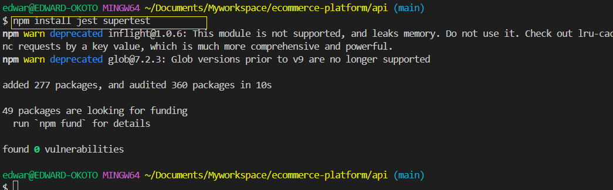

# ecommerce-platform

## E- Commerce Application CI/CD Pipeline

## Project Tasks

### Task 1: Project Setup


**1. Create Repository**
- Log in to GitHub, create a new repository named `ecommerce-platform`, and clone it locally.


- Clone it locally: Copy the repo URL,and run `git clone URL` on a terminal


**2. Create Directories**

- Inside the repository, create two folders:

```
mkdir api webapp
```


---

### Task 2: Initialize GitHub Actions

**1. Set Up GitHub Actions Directory**:

- Create the `.github/workflows` directory for your workflows.

```
mkdir -p .github/workflows
```

---

### Task 3: Backend API Setup

**1. Set Up Node.js/Express App**:
- Navigate to the `api` directory and initialize a Node.js project:

```
cd api
npm init -y
npm install express body-parser
```


- Create a basic `server.js` file
```
const express = require('express');
const app = express();
app.use(express.json());

// Basic route for testing
app.get('/', (req, res) => res.send('E-commerce API is running'));

// Route for product listing
app.get('/products', (req, res) => {
  const products = [
    { id: 1, name: 'Laptop', price: 1000 },
    { id: 2, name: 'Phone', price: 500 },
  ];
  res.json(products);
});

// Route for user login
app.post('/login', (req, res) => {
  const { username, password } = req.body;
  res.send(`User ${username} logged in successfully.`);
});

// Route for placing an order
app.post('/orders', (req, res) => {
  const order = req.body;
  res.send(`Order placed successfully for product ${order.productId}.`);
});

// Start the server
const PORT = 3000;
app.listen(PORT, () => console.log(`Server running on port ${PORT}`));
```


**2. Add Unit Tests**
- Install a testing library (e.g., Jest):

```
npm install jest supertest
```


**Unit Testing Test**

**Create a `tests` Folder**
- Create a folder named `tests`  inside the `api` directory to keep your test files organized:
```
mkdir tests
```
**Write Your Test Cases**
- Inside the `tests` folder, create a file for the API test cases, e.g (`api.test.js`)
```
touch tests/api.test.js
```
- Add the following sample test cases in `api.test.js`
```
const request = require('supertest');
const express = require('express');
const app = express();

app.use(express.json());

// Mock routes for testing
app.get('/', (req, res) => res.send('E-commerce API is running'));
app.get('/products', (req, res) => res.json([{ id: 1, name: 'Laptop' }]));
app.post('/login', (req, res) => {
  const { username, password } = req.body;
  res.status(200).send(`User ${username} logged in successfully.`);
});

describe('API Endpoints', () => {
  it('should return the default API response', async () => {
    const response = await request(app).get('/');
    expect(response.status).toBe(200);
    expect(response.text).toBe('E-commerce API is running');
  });

  it('should return a list of products', async () => {
    const response = await request(app).get('/products');
    expect(response.status).toBe(200);
    expect(response.body).toEqual([{ id: 1, name: 'Laptop' }]);
  });

  it('should return a login success message', async () => {
    const response = await request(app)
      .post('/login')
      .send({ username: 'testuser', password: 'testpassword' });
    expect(response.status).toBe(200);
    expect(response.text).toBe('User testuser logged in successfully.');
  });
});

```


- Modify the `package.json` file in your `api` directory

```
"scripts": {
  "test": "jest"
}
```
- Run Test in the `api` directory.

To run your test,use the following command.
```
npm test
```


**Task 4: Frontend Web Application Setup**

**1. Set-Up React App**:
- Navigate to the `webapp`  directory and create a React application:
```
cd ../webapp
npx create-react-app .
```
- Build Basic Features:
---

###### **Step 1: Set Up the React Application**
1. Navigate to the `webapp` directory and create your React app:
   ```bash
   cd webapp
   npx create-react-app .
   ```

2. Install Axios for API calls:
   ```bash
   npm install axios
   ```

---

###### **Step 2: Create Components**
Organize your app by creating individual components for product listing, user login, and order placement:

1. **Create a `components` Directory**:
   ```bash
   mkdir src/components
   ```

2. **Set Up Files for Each Feature**:

   Create files for each component:

   - `ProductList.js` for product listing.
   - `UserLogin.js` for user login.
   - `OrderPlacement.js` for placing orders.


---

###### **Step 3: Implement the Product Listing Component**
1. Create `src/components/ProductList.js`:
   ```javascript
   import React, { useState, useEffect } from 'react';
   import axios from 'axios';

   const ProductList = () => {
     const [products, setProducts] = useState([]);

     useEffect(() => {
       axios.get('/products') // Update the API URL as needed.
         .then((response) => setProducts(response.data))
         .catch((error) => console.error('Error fetching products:', error));
     }, []);

     return (
       <div>
         <h2>Product Listing</h2>
         <ul>
           {products.map(product => (
             <li key={product.id}>
               {product.name} - ${product.price}
             </li>
           ))}
         </ul>
       </div>
     );
   };

   export default ProductList;
   ```

---

###### **Step 4: Implement the User Login Component**
1. Create `src/components/UserLogin.js`:
   ```javascript
   import React, { useState } from 'react';
   import axios from 'axios';

   const UserLogin = () => {
     const [username, setUsername] = useState('');
     const [password, setPassword] = useState('');

     const handleLogin = () => {
       axios.post('/login', { username, password }) // Update the API URL as needed.
         .then((response) => alert(response.data))
         .catch((error) => console.error('Login failed:', error));
     };

     return (
       <div>
         <h2>User Login</h2>
         <input
           type="text"
           placeholder="Username"
           value={username}
           onChange={(e) => setUsername(e.target.value)}
         />
         <input
           type="password"
           placeholder="Password"
           value={password}
           onChange={(e) => setPassword(e.target.value)}
         />
         <button onClick={handleLogin}>Login</button>
       </div>
     );
   };

   export default UserLogin;
   ```

---

### **Step 5: Implement the Order Placement Component**
1. Create `src/components/OrderPlacement.js`:
   ```javascript
   import React, { useState } from 'react';
   import axios from 'axios';

   const OrderPlacement = () => {
     const [productId, setProductId] = useState('');
     const [quantity, setQuantity] = useState('');

     const placeOrder = () => {
       axios.post('/orders', { productId, quantity }) // Update the API URL as needed.
         .then((response) => alert(response.data))
         .catch((error) => console.error('Order failed:', error));
     };

     return (
       <div>
         <h2>Place an Order</h2>
         <input
           type="text"
           placeholder="Product ID"
           value={productId}
           onChange={(e) => setProductId(e.target.value)}
         />
         <input
           type="number"
           placeholder="Quantity"
           value={quantity}
           onChange={(e) => setQuantity(e.target.value)}
         />
         <button onClick={placeOrder}>Place Order</button>
       </div>
     );
   };

   export default OrderPlacement;
   ```

---

### **Step 6: Integrate Components into the Application**
1. Open `src/App.js` and import the components:
   ```javascript
   import React from 'react';
   import ProductList from './components/ProductList';
   import UserLogin from './components/UserLogin';
   import OrderPlacement from './components/OrderPlacement';

   const App = () => {
     return (
       <div>
         <h1>E-Commerce Platform</h1>
         <ProductList />
         <UserLogin />
         <OrderPlacement />
       </div>
     );
   };

   export default App;
   ```

2. Run the application:
   ```bash
   npm start
   ```

---

### **Step 7: Test Each Feature**
- Navigate to the product listing page to view available products.
- Use the user login form to simulate login operations.
- Place an order using the order placement form.

---

### **Step 8: Connect Backend API**
Ensure your backend API routes (`/products`, `/login`, `/orders`) are correctly configured and accessible from the React application. Update the API URLs as necessary to include the full backend URL, such as `http://localhost:3000`.

---


**Task 5: Continuous Integration Workflow**

**1. Create Workflow**:
- Create a CI workflow file in `.github/workflows/ci.yml`

```yaml
name: CI Workflow

on: [push, pull_request]

jobs:
  backend:
    runs-on: ubuntu-latest
    steps:
      - uses: actions/checkout@v2
      - name: Set up Node.js
        uses: actions/setup-node@v3
        with:
          node-version: 14
      - name: Install Dependencies
        run: npm install
        working-directory: api
      - name: Run Tests
        run: npm test
        working-directory: api

  frontend:
    runs-on: ubuntu-latest
    steps:
      - uses: actions/checkout@v2
      - name: Set up Node.js
        uses: actions/setup-node@v3
        with:
          node-version: 14
      - name: Install Dependencies
        run: npm install
        working-directory: webapp
      - name: Build Application
        run: npm run build
        working-directory: webapp
```

**Task 6: Docker Integration**

**1. Create Dockerfiles**

- Backend `api/Dockerfile`

```
FROM node:14
WORKDIR /app
COPY . .
RUN npm install
CMD ["node", "server.js"]
EXPOSE 3000
```

- Frontend `webapp/Dockerfile`

```
FROM node:14
WORKDIR /app
COPY . .
RUN npm install && npm run build
CMD ["npx", "serve", "-s", "build", "-l", "3000"]
EXPOSE 3000
```


```yaml
name: CI Workflow

on: [push, pull_request]

jobs:
  backend:
    runs-on: ubuntu-latest
    steps:
      - uses: actions/checkout@v2
      - name: Set up Node.js
        uses: actions/setup-node@v3
        with:
          node-version: 14
      - name: Install Dependencies
        run: npm install
        working-directory: api
      - name: Run Tests
        run: npm test
        working-directory: api
      - name: Build Backend Docker Image
        run: docker build -t backend-api ./api

  frontend:
    runs-on: ubuntu-latest
    steps:
      - uses: actions/checkout@v2
      - name: Set up Node.js
        uses: actions/setup-node@v3
        with:
          node-version: 14
      - name: Install Dependencies
        run: npm install
        working-directory: webapp
      - name: Build Application
        run: npm run build
        working-directory: webapp
      - name: Build Frontend Docker Image
        run: docker build -t frontend-webapp ./webapp
```

**2. Modify Workflow for Docker**

- Update your CI workflow to build Docker images:

```yaml
- name: Build Backend Docker Image
  run: docker build -t backend-api ./api
- name: Build Frontend Docker Image
  run: docker build -t frontend-webapp ./webapp
```
**Updated workflow**

```yaml
name: CI Workflow

on: [push, pull_request]

jobs:
  backend:
    runs-on: ubuntu-latest
    steps:
      - uses: actions/checkout@v2
      - name: Set up Node.js
        uses: actions/setup-node@v3
        with:
          node-version: 14
      - name: Install Dependencies
        run: npm install
        working-directory: api
      - name: Run Tests
        run: npm test
        working-directory: api
      - name: Build Backend Docker Image
        run: docker build -t backend-api ./api

  frontend:
    runs-on: ubuntu-latest
    steps:
      - uses: actions/checkout@v2
      - name: Set up Node.js
        uses: actions/setup-node@v3
        with:
          node-version: 14
      - name: Install Dependencies
        run: npm install
        working-directory: webapp
      - name: Build Application
        run: npm run build
        working-directory: webapp
      - name: Build Frontend Docker Image
        run: docker build -t frontend-webapp ./webapp
```

**Task 7: Deploy to Cloud**

**1. Choose a Cloud Platform:**

**2. Configure deployment in GitHub Actions**

To use GitHub Actions like `docker/login-action` and `docker/push-action` to push Docker images to Amazon Elastic Container Registry (ECR), follow these steps:

---

###### **Step 1: Configure an Amazon ECR Repository**
1. Log in to your AWS Management Console.
2. Navigate to **Amazon ECR**.
3. Create a new repository for your backend and frontend images.
   - For example:
     - `backend-api`
     - `frontend-webapp`
4. Note the repository URIs (e.g., `123456789012.dkr.ecr.us-east-1.amazonaws.com/backend-api`).

---

###### **Step 2: Set Up IAM Permissions**
1. Create an IAM user with permissions for ECR. Assign the following managed policy to the IAM user:
   - **AmazonEC2ContainerRegistryFullAccess**
2. Generate AWS Access and Secret Keys for the IAM user.
3. Store these credentials securely.

---

###### **Step 3: Update Your GitHub Repository Secrets**
1. In your GitHub repository, go to **Settings > Secrets and variables > Actions > New repository secret**.
2. Add the following secrets:
   - **`AWS_ACCESS_KEY_ID`**: The access key for your IAM user.
   - **`AWS_SECRET_ACCESS_KEY`**: The secret key for your IAM user.
   - **`AWS_REGION`**: The region where your ECR repository is located (e.g., `us-east-1`).

---

###### **Step 4: Create GitHub Actions Workflow**
Update your GitHub Actions workflow file (e.g., `.github/workflows/ci.yml`) to log in to ECR and push the Docker images.


Here’s the updated GitHub Actions workflow file to log in to Amazon ECR and push the Docker images for both the backend API and frontend webapp:

```yaml
name: CI Workflow

on: [push, pull_request]

jobs:
  push-docker-images:
    runs-on: ubuntu-latest

    steps:
      # Step 1: Check out the code
      - name: Checkout code
        uses: actions/checkout@v2

      # Step 2: Log in to Amazon ECR
      - name: Log in to Amazon ECR
        uses: docker/login-action@v2
        with:
          registry: ${{ secrets.AWS_ACCOUNT_ID }}.dkr.ecr.${{ secrets.AWS_REGION }}.amazonaws.com
          username: AWS
          password: ${{ secrets.AWS_SECRET_ACCESS_KEY }}

      # Step 3: Build and tag Docker images
      - name: Build backend Docker image
        run: docker build -t backend-api ./api
      - name: Tag backend Docker image
        run: docker tag backend-api:latest ${{ secrets.AWS_ACCOUNT_ID }}.dkr.ecr.${{ secrets.AWS_REGION }}.amazonaws.com/backend-api:latest

      - name: Build frontend Docker image
        run: docker build -t frontend-webapp ./webapp
      - name: Tag frontend Docker image
        run: docker tag frontend-webapp:latest ${{ secrets.AWS_ACCOUNT_ID }}.dkr.ecr.${{ secrets.AWS_REGION }}.amazonaws.com/frontend-webapp:latest

      # Step 4: Push Docker images to Amazon ECR
      - name: Push backend Docker image
        uses: docker/push-action@v2
        with:
          registry: ${{ secrets.AWS_ACCOUNT_ID }}.dkr.ecr.${{ secrets.AWS_REGION }}.amazonaws.com
          repository: backend-api
          tag: latest

      - name: Push frontend Docker image
        uses: docker/push-action@v2
        with:
          registry: ${{ secrets.AWS_ACCOUNT_ID }}.dkr.ecr.${{ secrets.AWS_REGION }}.amazonaws.com
          repository: frontend-webapp
          tag: latest
```

##### **Instructions:**
1. Replace `AWS_ACCOUNT_ID`, `AWS_REGION`, `AWS_ACCESS_KEY_ID`, and `AWS_SECRET_ACCESS_KEY` with appropriate values stored in your GitHub repository secrets.
2. Save this updated file as `.github/workflows/ci.yml` in your repository.
---


Here’s your updated `ci.yml` workflow with the specified steps added for logging into AWS ECR and pushing the Docker images:

```yaml
name: CI Workflow

on: [push, pull_request]

jobs:
  push-docker-images:
    runs-on: ubuntu-latest

    steps:
      # Step 1: Check out the code
      - name: Checkout code
        uses: actions/checkout@v2

      # Step 2: Log in to AWS ECR
      - name: Log in to AWS ECR
        uses: aws-actions/amazon-ecr-login@v1

      # Step 3: Build and tag Docker images
      - name: Build backend Docker image
        run: docker build -t backend-api ./api
      - name: Tag backend Docker image
        run: docker tag backend-api:latest ${{ secrets.AWS_ACCOUNT_ID }}.dkr.ecr.${{ secrets.AWS_REGION }}.amazonaws.com/backend-api:latest

      - name: Build frontend Docker image
        run: docker build -t frontend-webapp ./webapp
      - name: Tag frontend Docker image
        run: docker tag frontend-webapp:latest ${{ secrets.AWS_ACCOUNT_ID }}.dkr.ecr.${{ secrets.AWS_REGION }}.amazonaws.com/frontend-webapp:latest

      # Step 4: Push Docker images to AWS ECR
      - name: Push backend Docker image
        run: docker push ${{ secrets.AWS_ACCOUNT_ID }}.dkr.ecr.${{ secrets.AWS_REGION }}.amazonaws.com/backend-api:latest

      - name: Push frontend Docker image
        run: docker push ${{ secrets.AWS_ACCOUNT_ID }}.dkr.ecr.${{ secrets.AWS_REGION }}.amazonaws.com/frontend-webapp:latest
```

###### **Key Details Added:**
1. **Log in to AWS ECR**:
   - Added the step: `uses: aws-actions/amazon-ecr-login@v1`.

2. **Push to ECR**:
   - Explicitly included the `run: docker push <your-image-url>` command for both backend and frontend images.

##### Next Steps:
- Replace `<your-image-url>` placeholders with the actual image URLs, as defined by your Amazon ECR setup.
- Save the updated workflow file in `.github/workflows/ci.yml`.
- Commit and push the changes to your repository.

**3. Store Cloud Credentials**:
- Add credentials as GitHub Secrets:

```
- name: Log in to AWS ECR
  uses: aws-actions/amazon-ecr-login@v1
- name: Push to ECR
  run: docker push <your-image-url>
```


**Task 9: Performance and Security**

**1. Implement Caching**
- Add caching to speed up builds.

**2. Secure Sensitive Data**
- Use environment variables for secrets


`ci.yml` save the workflow and push to GitHub repository.

```yaml
name: CI Workflow

on:
  push:
    branches:
      - main
  pull_request:

jobs:
  push-docker-images:
    runs-on: ubuntu-latest
    env:
      ACCESS_TOKEN: ${{ secrets.ACCESS_TOKEN }}
      AWS_ACCOUNT_ID: ${{ secrets.AWS_ACCOUNT_ID }}
      AWS_REGION: ${{ secrets.AWS_REGION }}
      AWS_SECRET_ACCESS_KEY: ${{ secrets.AWS_SECRET_ACCESS_KEY }}

    steps:
      # Step 1: Check out the code
      - name: Checkout code
        uses: actions/checkout@v2

      # Step 2: Cache NPM dependencies
      - uses: actions/cache@v2
        with:
          path: ~/.npm
          key: ${{ runner.os }}-node-${{ hashFiles('**/package-lock.json') }}
          restore-keys: ${{ runner.os }}-node-

      # Step 3: Log in to AWS ECR
      - name: Log in to AWS ECR
        uses: aws-actions/amazon-ecr-login@v1

      # Step 4: Build and tag Docker images
      - name: Build backend Docker image
        run: docker build -t backend-api ./api
      - name: Tag backend Docker image
        run: docker tag backend-api:latest ${{ secrets.AWS_ACCOUNT_ID }}.dkr.ecr.${{ secrets.AWS_REGION }}.amazonaws.com/backend-api:latest

      - name: Build frontend Docker image
        run: docker build -t frontend-webapp ./webapp
      - name: Tag frontend Docker image
        run: docker tag frontend-webapp:latest ${{ secrets.AWS_ACCOUNT_ID }}.dkr.ecr.${{ secrets.AWS_REGION }}.amazonaws.com/frontend-webapp:latest

      # Step 5: Push Docker images to AWS ECR
      - name: Push backend Docker image
        run: docker push ${{ secrets.AWS_ACCOUNT_ID }}.dkr.ecr.${{ secrets.AWS_REGION }}.amazonaws.com/backend-api:latest

      - name: Push frontend Docker image
        run: docker push ${{ secrets.AWS_ACCOUNT_ID }}.dkr.ecr.${{ secrets.AWS_REGION }}.amazonaws.com/frontend-webapp:latest
```

